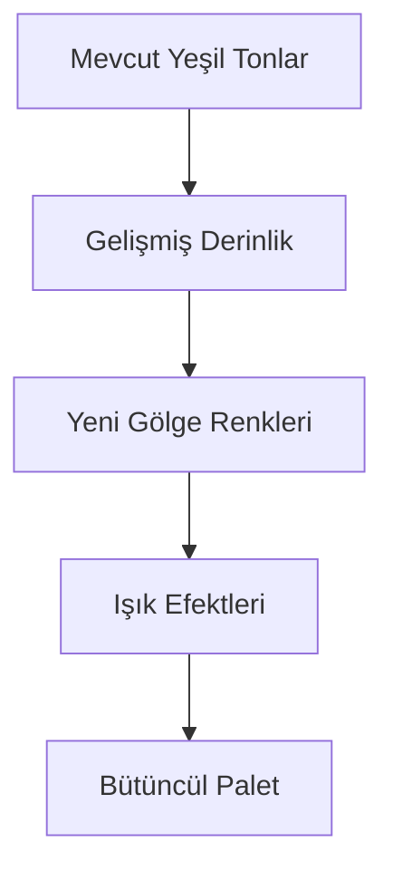

# 🚀 Nöromorfik Tasarım Dönüşümü - Kapsamlı Roadmap

## 📋 Genel Bakış
Bu döküman, mevcut Barter Qween uygulamasının tüm ekranlarını Pinterest örneklerindeki gibi gelişmiş nöromorfik tasarıma dönüştürmek için detaylı planı içermektedir.

## 🎯 Hedefler
- **Daha Derin**: Çok katmanlı gölge efektleri
- **Daha Yüksek**: Üç boyutlu yükseklik hissi
- **Daha Işıklı**: Gelişmiş ışık yansımaları
- **Daha Zarif**: İnce geçişler ve detaylar
- **Bütüncül**: Tüm arkaplan aynı, ince çizgi geçişleri

## 📊 Mevcut Sayfa Analizi

### 🏠 **ANA SAYFALAR (Core Pages)**
1. **Login Page** - Glassmorphism efektli giriş sayfası
2. **Register Page** - Kayıt sayfası
3. **Home Page V2** - Ana sayfa (modern tasarım)
4. **Dashboard Page** - Kontrol paneli

### ⚡ **ÖZELLİK SAYFALARI (Feature Pages)**
1. **Item Management**
   - Create Item Page - İlan oluşturma
   - Edit Item Page - İlan düzenleme
   - Item Detail Page - İlan detayları
   - Item List Page - İlan listesi
   - User Items Page - Kullanıcı ilanları

2. **Chat System**
   - Chat Detail Page - Sohbet detayları
   - Chat List Page V2 - Sohbet listesi
   - Conversations List Page - Konuşmalar

3. **User Management**
   - Profile Page V2 - Profil sayfası
   - Edit Profile Page - Profil düzenleme
   - User Profile Page - Diğer kullanıcı profilleri

4. **Discovery**
   - Explore Page V2 - Keşfet sayfası
   - Search Page - Arama sayfası
   - Favorites Page - Favoriler

5. **Trading**
   - Trades Page - Takaslar
   - Trade Detail Page - Takas detayları
   - Send Trade Offer Page - Takas teklifi
   - Trade History Page - Takas geçmişi

### 🛠️ **YARDIMCI SAYFALAR (Utility Pages)**
1. **Onboarding Page** - Başlangıç sayfası
2. **Notifications Page** - Bildirimler
3. **Payment Selection Page** - Ödeme seçimi
4. **Premium Plans Page** - Premium planlar
5. **Privacy Policy & Terms** - Hukuki sayfalar
6. **Admin Dashboard** - Yönetici paneli

## 🎨 **Nöromorfik Dönüşüm Stratejisi**

### 1️⃣ **RENK PALETİ GELİŞTİRME**

**Mevcut Palet:**
- Primary: #3E7E55 (Koyu doğal yeşil)
- Secondary: #AADC86 (Açık yeşil)
- Background: #EAEEE5 (Açık doğal yeşil)

**Yeni Nöromorfik Palet:**
- **Derin Gölgeler**: Daha koyu varyasyonlar
- **Yüksek Işıklar**: Daha açık varyasyonlar
- **Geçiş Tonları**: İnce renk geçişleri

### 2️⃣ **GÖLGE SİSTEMİ**
- **Çoklu Gölge Katmanları**: 3-5 farklı gölge seviyesi
- **Dinamik Gölgeler**: İnteraksiyona göre değişen
- **Renkli Gölgeler**: Renge göre uyarlanan

### 3️⃣ **IŞIK EFEKTLERİ**
- **Gradient Overlays**: Çok katmanlı ışık geçişleri
- **Specular Highlights**: Metalik yansımalar
- **Ambient Lighting**: Çevre ışıklandırması

## 📋 **Detaylı Çalışma Planı**

### 🔄 **FAZ 1: Tasarım Sistemi Oluşturma**
- [ ] Gelişmiş nöromorfik renk paleti oluştur
- [ ] Çok katmanlı gölge standartları belirle
- [ ] Işık efektleri için shader'lar geliştir
- [ ] Tüm UI bileşenleri için nöromorfik şablonlar hazırla

### 🏗️ **FAZ 2: UI Bileşenleri Dönüşümü**
- [ ] NeumorphismContainer widget'ını geliştir
- [ ] Tüm buton türlerini nöromorfik yap
- [ ] Kart ve panel bileşenlerini dönüştür
- [ ] Input alanlarını ışık efektli yap

### 🏠 **FAZ 3: Ana Sayfalar**
- [ ] Login Page - Cam efektli nöromorfik giriş
- [ ] Register Page - Derinlikli kayıt formu
- [ ] Home Page V2 - Çok katmanlı ana sayfa
- [ ] Dashboard Page - Kontrol paneli dönüşümü

### ⚡ **FAZ 4: Özellik Sayfaları**
- [ ] Item sayfaları - 3D ürün kartları
- [ ] Chat sistemi - Konuşma baloncukları
- [ ] Profile sayfaları - Derin profil kartları
- [ ] Search sayfası - Akıllı arama kutusu

### 🛠️ **FAZ 5: Yardımcı Sayfalar**
- [ ] Onboarding - İnteraktif başlangıç
- [ ] Notifications - Bildirim kartları
- [ ] Payment - Güvenli ödeme formları
- [ ] Admin - Yönetici arayüzü

### ✨ **FAZ 6: Animasyon ve Geçişler**
- [ ] Sayfa geçiş animasyonları
- [ ] Buton tıklama efektleri
- [ ] Loading animasyonları
- [ ] Hover efektleri

### 🔧 **FAZ 7: Optimizasyon**
- [ ] Performance optimizasyonu
- [ ] Responsive tasarım güncellemeleri
- [ ] Accessibility iyileştirmeleri
- [ ] Cross-platform uyumluluk

## 🎯 **Pinterest İlham Kaynakları Uygulanması**

### 📌 **Pin 1-2: Login Ekranları**
- Cam efektli arkaplan
- Yüzen form elemanları
- Gradient ışık geçişleri

### 📌 **Pin 3-4: Buton ve İkonlar**
- Çok katmanlı gölge efektleri
- Metalik yansımalar
- Basınca göre şekil değişimi

### 📌 **Pin 5-6: Kart Tasarımları**
- 3D derinlik efektleri
- Kenar ışıklandırmaları
- Gölge katmanları

### 📌 **Pin 7-8: Genel UI**
- Bütüncül arkaplan sistemi
- İnce geçiş çizgileri
- Atmosferik aydınlatma

## 📊 **Başarı Kriterleri**

### 🎨 **Görsel Kriterler**
- [ ] Pinterest örnekleri seviyesinde derinlik
- [ ] Çok katmanlı ışık-gölge dengesi
- [ ] Bütüncül tasarım dili
- [ ] Premium kullanıcı deneyimi

### ⚡ **Teknik Kriterler**
- [ ] 60 FPS performans
- [ ] Tüm cihazlarda tutarlı görünüm
- [ ] Erişilebilirlik standartları
- [ ] Responsive tasarım

### 📱 **Kullanıcı Deneyimi**
- [ ] Sezgisel navigasyon
- [ ] Hızlı yükleme süreleri
- [ ] Düşük bilişsel yük
- [ ] Estetik memnuniyet

## 🚀 **İmplementasyon Yaklaşımı**

### 🔄 **Yöntem**
1. **Analiz**: Mevcut kodları detaylı incele
2. **Tasarım**: Nöromorfik şablonlar oluştur
3. **Geliştirme**: Widget'ları tek tek dönüştür
4. **Test**: Her aşamada kullanıcı testi yap
5. **Optimizasyon**: Performance ve UX iyileştir

### 📝 **Kodlama Standartları**
- Clean Architecture prensipleri
- SOLID prensipler
- Responsive tasarım
- Performance optimizasyonu
- Accessibility best practices

## 📈 **İlerleme Takibi**

Her aşama tamamlandığında:
- [ ] Kod review yapılacak
- [ ] UI/UX test edilecek
- [ ] Performance ölçülecek
- [ ] Kullanıcı geri bildirimi alınacak

## 🎯 **Sonuç**
Bu roadmap tamamlandığında Barter Qween uygulaması, Pinterest'teki nöromorfik örnekler seviyesinde, dünya standartlarında bir mobil uygulama arayüzüne sahip olacak.

---
*Bu döküman dinamik olarak güncellenecektir.*