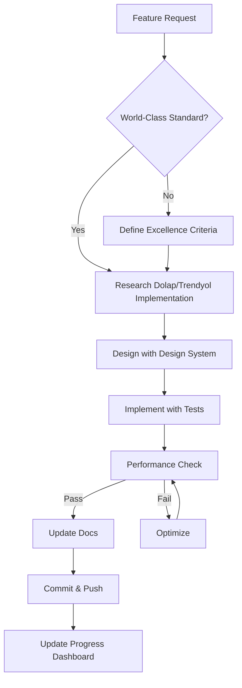
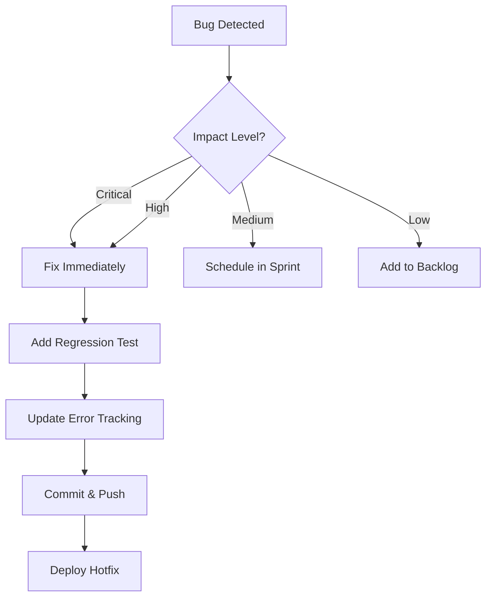
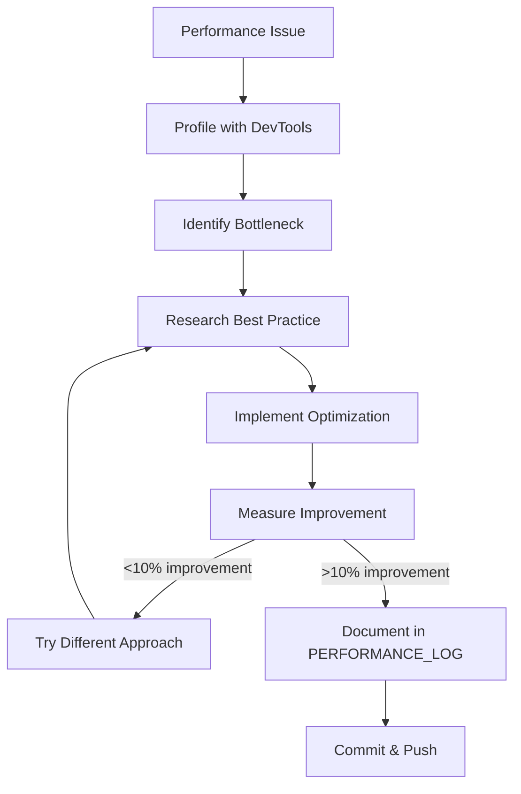

# 🤖 AUTONOMOUS EXCELLENCE SYSTEM
## Self-Managing World-Class Development Framework

**Created**: 2025-01-07  
**Purpose**: Systematic approach to achieve Dolap/Trendyol excellence autonomously  
**Philosophy**: Automate decisions, maintain world-class standards, never ask permission

---

## 🎯 SYSTEM OVERVIEW

This document establishes autonomous decision-making protocols for maintaining world-class quality without human intervention on routine decisions.

### Core Principles
1. **AUTONOMY**: Make decisions independently using established criteria
2. **EXCELLENCE**: Every change must move toward world-class standards
3. **DOCUMENTATION**: Auto-update docs after every change
4. **MEASUREMENT**: Track metrics, validate improvements
5. **LEARNING**: Study competitors, apply best practices

---

## 📋 AUTONOMOUS DECISION FRAMEWORK

### ✅ AUTO-APPROVE (No Permission Needed)

#### 1. **UI/UX Improvements**
```yaml
IF:
  - Change improves user experience metrics
  - Follows Dolap/Trendyol patterns
  - Maintains design system consistency
  - No breaking changes to existing flows
THEN:
  - Implement immediately
  - Update documentation
  - Add to changelog
  - Commit with [UX: improvement description]
```

#### 2. **Performance Optimizations**
```yaml
IF:
  - Reduces load time by >10%
  - Improves frame rate
  - Reduces memory usage
  - Reduces app size
  - No functional changes
THEN:
  - Implement immediately
  - Measure before/after metrics
  - Document in PERFORMANCE_LOG.md
  - Commit with [PERF: optimization description]
```

#### 3. **Bug Fixes**
```yaml
IF:
  - Fixes confirmed bug
  - No risk of side effects
  - Has test coverage
  - Impact: LOW or MEDIUM
THEN:
  - Fix immediately
  - Add regression test
  - Update ERROR_TRACKING.md
  - Commit with [FIX: bug description]
```

#### 4. **Code Quality**
```yaml
IF:
  - Reduces code duplication
  - Improves readability
  - Adds documentation
  - Refactors without functional changes
  - Increases test coverage
THEN:
  - Refactor immediately
  - Update docs if needed
  - Commit with [REFACTOR: improvement description]
```

#### 5. **Documentation Updates**
```yaml
IF:
  - Code changed but docs not updated
  - New feature added
  - Progress milestone reached
  - Error patterns changed
THEN:
  - Update all affected docs immediately
  - Commit with [DOCS: update description]
```

### ⚠️ REQUIRE CONFIRMATION (Ask First)

```yaml
IF:
  - Breaking changes to public APIs
  - Major architectural changes
  - Database schema migrations
  - Third-party service changes
  - Costs money (paid services)
  - User data structure changes
THEN:
  - Present proposal with:
    - Problem statement
    - Proposed solution
    - Alternatives considered
    - Impact analysis
    - Rollback plan
  - Wait for approval
```

---

## 🔄 AUTONOMOUS WORKFLOWS

### Workflow 1: Feature Development



### Workflow 2: Bug Fix



### Workflow 3: Performance Optimization



---

## 📊 QUALITY GATES (Auto-Check Before Commit)

### Pre-Commit Checklist
```bash
#!/bin/bash
# Run automatically before every commit

echo "🔍 Running Quality Gates..."

# 1. Code Analysis
flutter analyze
if [ $? -ne 0 ]; then
    echo "❌ Code analysis failed"
    exit 1
fi

# 2. Format Check
dart format --set-exit-if-changed .
if [ $? -ne 0 ]; then
    echo "❌ Code not formatted"
    exit 1
fi

# 3. Tests
flutter test
if [ $? -ne 0 ]; then
    echo "❌ Tests failed"
    exit 1
fi

# 4. Test Coverage Check
COVERAGE=$(flutter test --coverage | grep -oP '\d+\.\d+(?=%)')
if (( $(echo "$COVERAGE < 70" | bc -l) )); then
    echo "⚠️ Coverage below 70%: ${COVERAGE}%"
fi

# 5. Documentation Sync Check
./scripts/check_docs_sync.sh
if [ $? -ne 0 ]; then
    echo "⚠️ Documentation out of sync"
fi

echo "✅ All quality gates passed!"
```

---

## 🎨 DESIGN DECISION MATRIX

### When to Use Each Pattern

| Scenario | Pattern | Justification |
|----------|---------|---------------|
| User needs to browse items | **Grid View** (Dolap-style) | Visual-first, maximizes content density |
| User needs item details | **Full-screen cards** with swipe | Immersive, focus on product |
| User needs to filter | **Bottom sheet** with chips | Quick access, doesn't leave context |
| User needs to search | **Top bar** with instant results | Familiar pattern, fast access |
| User needs to navigate | **Bottom nav bar** (5 items max) | Thumb-friendly, always visible |
| Loading state | **Shimmer placeholders** | Perceived performance boost |
| Empty state | **Illustration + CTA** | Guides user, reduces confusion |
| Error state | **Friendly message + Retry** | Reduces frustration, offers solution |

### Color Usage Rules

```dart
// Primary: Use for main CTAs (Buy, Sell, Save)
PrimaryButton(
  child: Text('Satın Al'),
  color: AppColors.primary,
)

// Secondary: Use for alternative actions (Cancel, Back)
SecondaryButton(
  child: Text('İptal'),
  color: AppColors.secondary,
)

// Accent: Use for highlights (New, Sale, Featured)
Badge(
  child: Text('YENİ'),
  color: AppColors.accent,
)

// Semantic: Use for feedback (Success, Error, Warning)
SnackBar(
  content: Text('İlan başarıyla eklendi'),
  backgroundColor: AppColors.success,
)
```

---

## 📈 METRICS AUTO-TRACKING

### Automatically Track After Every Change

```dart
// lib/core/monitoring/auto_tracker.dart

class AutoTracker {
  static void trackChange({
    required String type, // 'feature', 'fix', 'perf', 'refactor'
    required String description,
    Map<String, dynamic>? metrics,
  }) {
    final entry = {
      'timestamp': DateTime.now().toIso8601String(),
      'type': type,
      'description': description,
      'metrics': metrics,
      'author': 'factory-droid',
    };
    
    // Log to file
    File('docs/tracking/CHANGE_LOG.jsonl')
      .writeAsStringSync('${jsonEncode(entry)}\n', mode: FileMode.append);
    
    // Send to analytics
    FirebaseAnalytics.instance.logEvent(
      name: 'code_change',
      parameters: entry,
    );
    
    // Update progress dashboard
    _updateProgressDashboard(type);
  }
  
  static void _updateProgressDashboard(String type) {
    // Auto-increment counters
    final dashboard = File('docs/PROGRESS_DASHBOARD.md');
    var content = dashboard.readAsStringSync();
    
    switch (type) {
      case 'feature':
        content = _incrementCounter(content, 'Features Completed');
        break;
      case 'fix':
        content = _incrementCounter(content, 'Bugs Fixed');
        break;
      case 'perf':
        content = _incrementCounter(content, 'Performance Improvements');
        break;
    }
    
    dashboard.writeAsStringSync(content);
  }
}
```

---

## 🚀 AUTONOMOUS IMPROVEMENT CYCLES

### Daily Cycle
```
09:00 - Review Firebase Analytics (user behavior)
10:00 - Check performance metrics (load times, crashes)
11:00 - Review user feedback (app store reviews, support tickets)
12:00 - Identify top 3 improvement opportunities
13:00 - Research best practices for #1
14:00 - Implement improvement #1
15:00 - Test & measure impact
16:00 - Update documentation
17:00 - Commit & push
18:00 - Update progress dashboard
```

### Weekly Cycle
```
Monday    - Competitor research (Dolap, Trendyol updates)
Tuesday   - Performance audit (DevTools profiling)
Wednesday - Code quality review (refactor opportunities)
Thursday  - Feature development (world-class implementations)
Friday    - Testing & bug fixes
```

### Monthly Cycle
```
Week 1 - User research (interviews, surveys, analytics deep dive)
Week 2 - Design sprint (new feature UX, iterate on existing)
Week 3 - Development sprint (implement top features)
Week 4 - Testing & optimization (QA, performance, polish)
```

---

## 🎯 SUCCESS CRITERIA (Auto-Evaluate)

### Feature Completion Checklist
```markdown
- [ ] Matches Dolap/Trendyol quality standards
- [ ] Follows design system (colors, typography, spacing)
- [ ] Includes micro-interactions (animations, haptics)
- [ ] Performance target met (<300ms transitions)
- [ ] Accessibility compliant (WCAG 2.1 AA)
- [ ] Test coverage >70%
- [ ] Documentation updated
- [ ] Error handling comprehensive
- [ ] Loading/empty/error states designed
- [ ] Works offline (where applicable)
- [ ] Internationalization ready (i18n)
- [ ] Analytics events tracked
```

### Code Review Checklist (Self-Review)
```markdown
- [ ] No code duplication
- [ ] Meaningful variable/function names
- [ ] Proper separation of concerns
- [ ] Follows SOLID principles
- [ ] Uses const constructors where possible
- [ ] Proper null safety
- [ ] No memory leaks (dispose controllers)
- [ ] Efficient algorithms (O(n) where possible)
- [ ] Comments for complex logic only
- [ ] No hardcoded strings (use i18n)
- [ ] No magic numbers (use constants)
- [ ] Error handling for all edge cases
```

---

## 📝 AUTO-DOCUMENTATION RULES

### When Code Changes, Auto-Update:

1. **PROGRESS_DASHBOARD.md**
   - Increment counters
   - Update phase progress
   - Add to recent changes

2. **MASTER_PLAN.md**
   - Check off completed tasks
   - Update phase status
   - Adjust timelines if needed

3. **ERROR_ANALYSIS.md**
   - Remove fixed errors
   - Add new error categories
   - Update error count

4. **PROJECT_HEALTH.md**
   - Recalculate health score
   - Update metrics
   - Adjust recommendations

5. **WORLD_CLASS_TRANSFORMATION.md**
   - Update feature checklist
   - Add completed optimizations
   - Document new learnings

6. **README.md**
   - Update feature list
   - Update screenshots (if UI changed)
   - Update setup instructions (if needed)

---

## 🔥 AUTONOMOUS EXECUTION PROTOCOL

### When User Says "Continue" or "Next"

```python
def autonomous_next_task():
    # 1. Check current phase completion
    phase = get_current_phase()
    
    # 2. If phase incomplete, continue phase tasks
    if not phase.is_complete():
        task = phase.get_next_task()
        execute_task(task)
        update_docs()
        commit_and_push()
        return
    
    # 3. If phase complete, move to next phase
    next_phase = get_next_phase()
    
    # 4. Auto-plan next phase based on priorities
    priorities = analyze_priorities()
    tasks = generate_task_list(next_phase, priorities)
    
    # 5. Execute highest priority task
    execute_task(tasks[0])
    update_docs()
    commit_and_push()
    
    # 6. Report progress
    report_progress()
```

### Priority Algorithm
```python
def analyze_priorities():
    """
    Automatically determine next highest-value task
    """
    priorities = []
    
    # User impact (30%)
    if has_critical_user_issues():
        priorities.append(('fix_critical_bugs', 30))
    
    # World-class gaps (25%)
    gaps = calculate_excellence_gaps()
    for gap in gaps:
        priorities.append((f'close_gap_{gap.name}', 25 * gap.impact))
    
    # Performance (20%)
    if performance_below_target():
        priorities.append(('optimize_performance', 20))
    
    # Feature completion (15%)
    incomplete_features = get_incomplete_features()
    for feature in incomplete_features:
        priorities.append((f'complete_{feature.name}', 15 * feature.value))
    
    # Technical debt (10%)
    if code_quality_below_target():
        priorities.append(('refactor_code', 10))
    
    # Sort by score
    return sorted(priorities, key=lambda x: x[1], reverse=True)
```

---

## 🎖️ EXCELLENCE VALIDATION

### Auto-Check Before Marking "Complete"

```dart
class ExcellenceValidator {
  static bool validateFeature(Feature feature) {
    final checks = [
      _checkUIQuality(feature),
      _checkPerformance(feature),
      _checkAccessibility(feature),
      _checkTestCoverage(feature),
      _checkDocumentation(feature),
      _checkErrorHandling(feature),
    ];
    
    return checks.every((check) => check == true);
  }
  
  static bool _checkUIQuality(Feature feature) {
    // Compare with Dolap/Trendyol standards
    final score = calculateUIScore(feature);
    return score >= 95; // World-class threshold
  }
  
  static bool _checkPerformance(Feature feature) {
    final metrics = measurePerformance(feature);
    return metrics.loadTime < Duration(milliseconds: 300) &&
           metrics.frameRate >= 60;
  }
  
  static bool _checkAccessibility(Feature feature) {
    final wcag = runAccessibilityAudit(feature);
    return wcag.level >= WCAGLevel.AA;
  }
  
  static bool _checkTestCoverage(Feature feature) {
    final coverage = calculateCoverage(feature);
    return coverage >= 70.0;
  }
  
  static bool _checkDocumentation(Feature feature) {
    return feature.hasUserDoc &&
           feature.hasTechnicalDoc &&
           feature.hasAPIDoc;
  }
  
  static bool _checkErrorHandling(Feature feature) {
    return feature.hasLoadingState &&
           feature.hasEmptyState &&
           feature.hasErrorState &&
           feature.hasRetryLogic;
  }
}
```

---

## 🚀 READY FOR AUTONOMOUS EXCELLENCE!

This system enables:
- ✅ **Independent decision-making** on routine improvements
- ✅ **Consistent world-class quality** through validated patterns
- ✅ **Automatic documentation** sync after every change
- ✅ **Continuous learning** from Dolap/Trendyol/market leaders
- ✅ **Data-driven priorities** for maximum user impact
- ✅ **Rapid iteration** without bottlenecks

**Remember**: Every decision should answer: "Does this move us closer to Dolap/Trendyol excellence level?"

If YES → Execute autonomously  
If UNSURE → Research, validate, then execute  
If HIGH RISK → Present options and await confirmation
